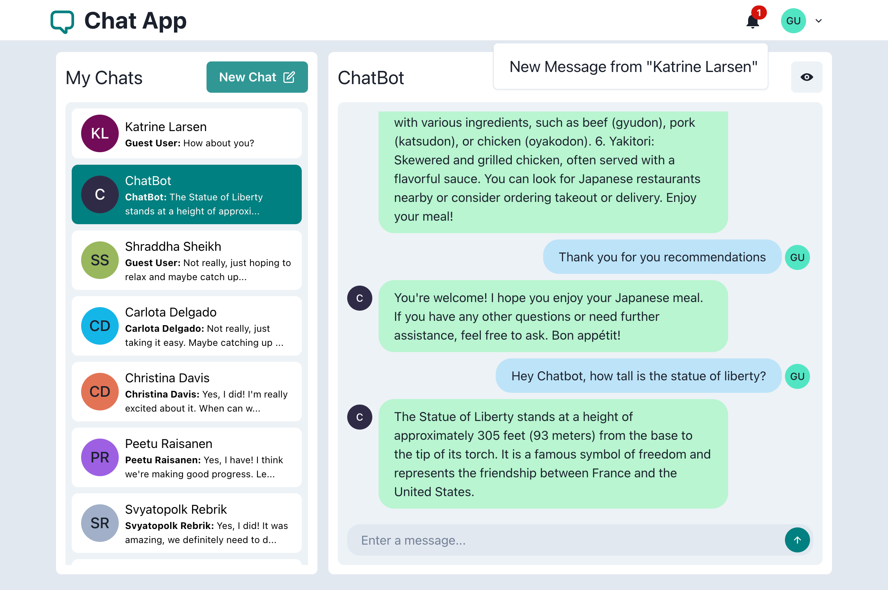
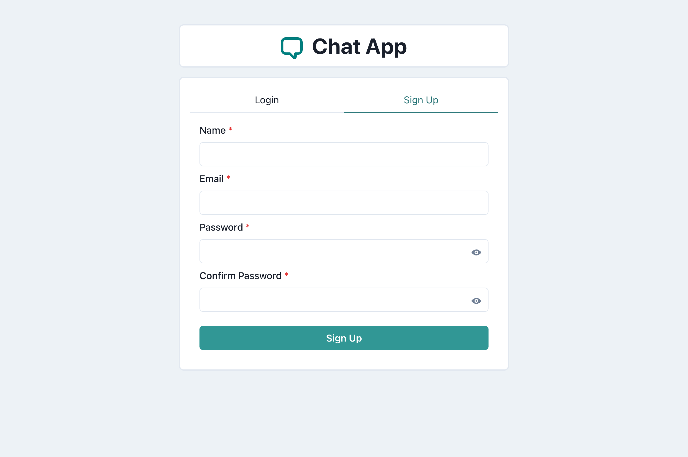
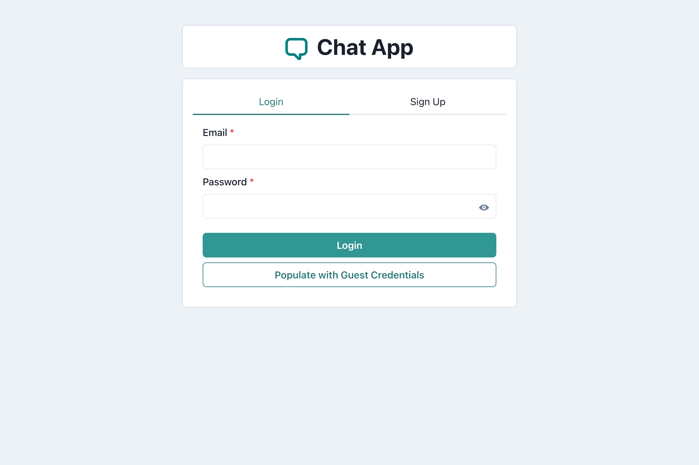
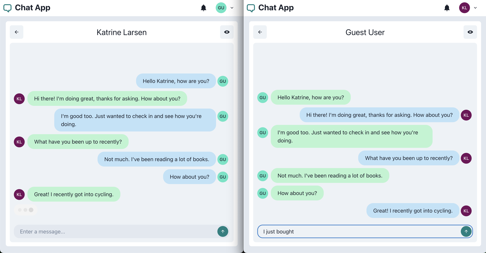
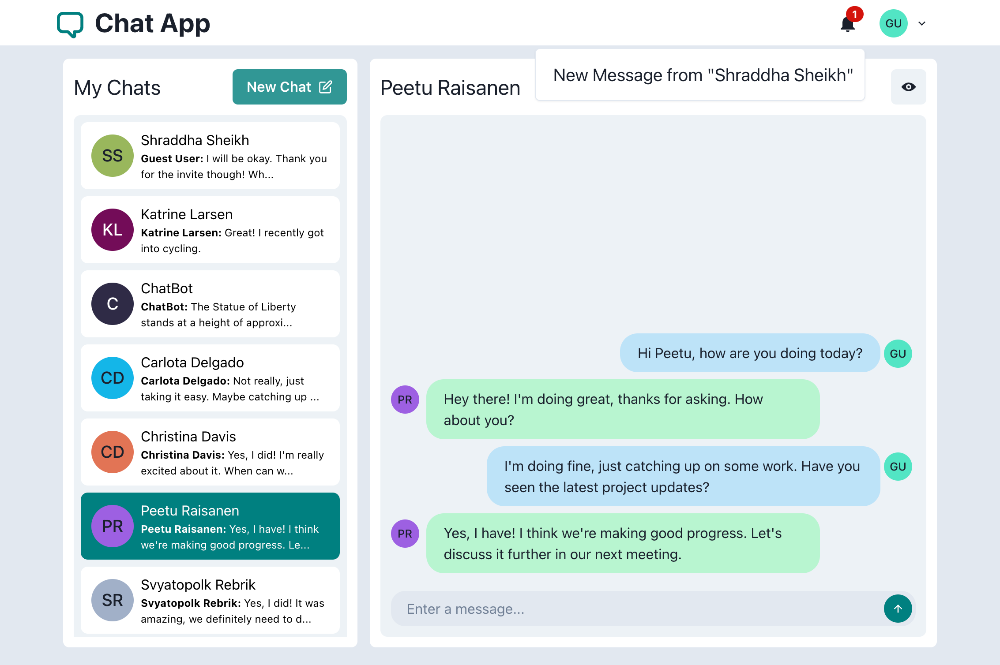
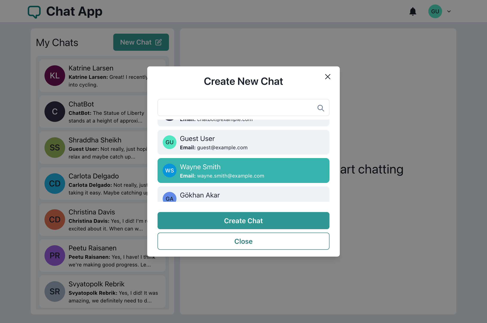
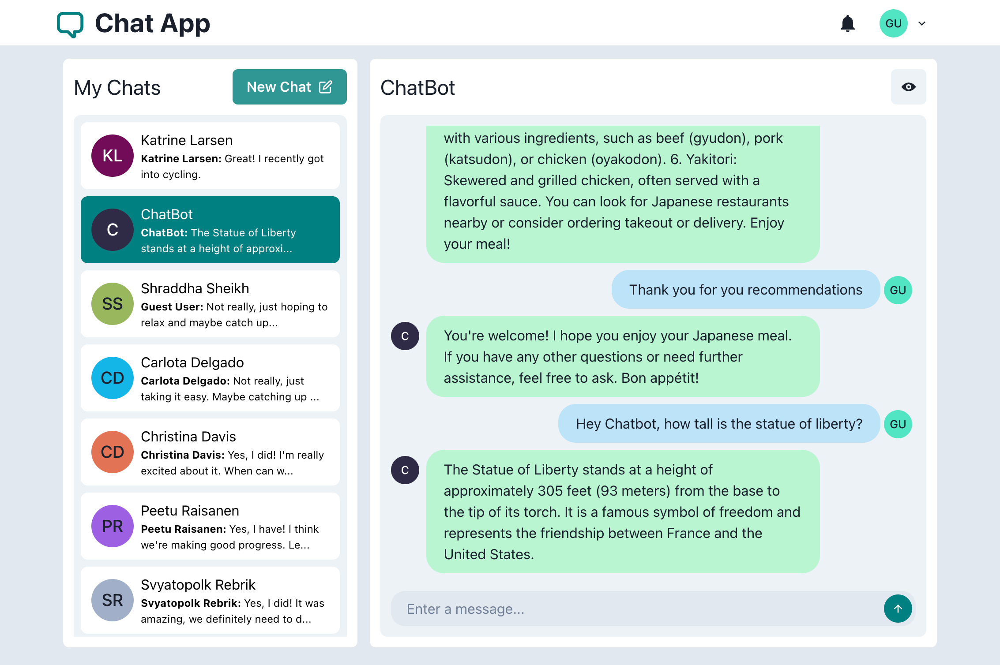
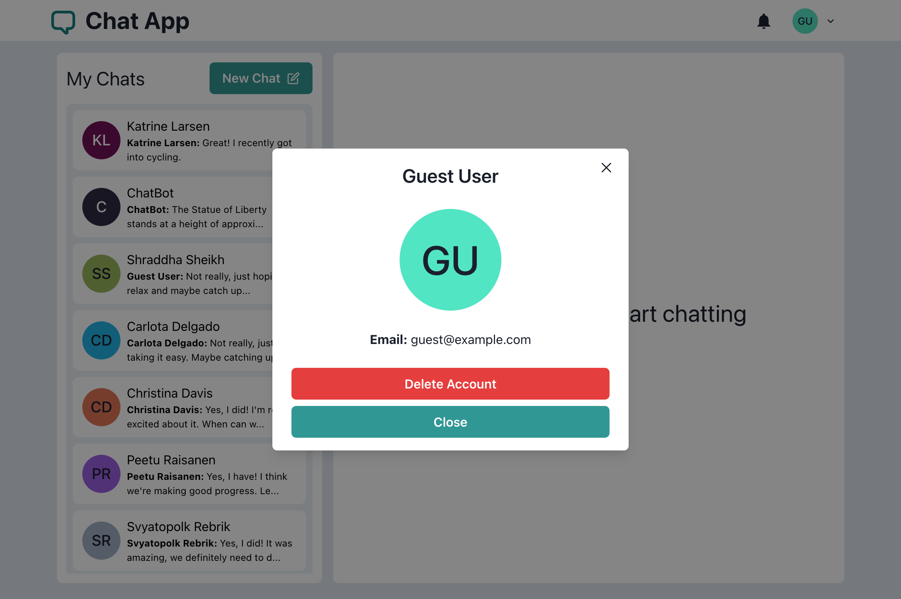

# Chat App

> Chat App is a full-stack chat application on the web. The application utilizes
> WebSocket for real-time communication and notifications. User details and persistent
> chat data are encrypted and stored on the server. Users can chat with a chatbot
> powered by OpenAI Chat Completions API.

## Demo

[Deployment Link](https://chat-app-i9jv.onrender.com)



## Features

### Authentication

Users can sign up and login.




### Real-time messaging with typing indicator

Message list automatically updates with a new incoming message.
Typing indicator shows when the other user is typing.



### Notification

Users get notified of new messages in the notification badge.



### Create new chat

A new chat can be created with any user on the platform.



### Chatbot

Users can have a conversation with a chatbot powered by OpenAI API.



### View user profile

User profile can be viewed. The logged-in user can also delete their account.



## Getting Started

1. Create a `.env` file and fill in all variables following `.env.template`
2. Go to project directory then install dependencies for both server and client

   ```shell
   cd chat-app
   npm run install:all
   ```

3. Run the server in dev mode with hot reload

   ```shell
   cd server
   npm run dev
   ```

4. Run the client in dev mode with hot reload

   ```shell
   cd client
   npm start
   ```

## Technologies

- **Languages:** Typescript, Javascript, HTML, CSS
- **Frameworks:** React.js, Node.js, Express.js, Socket.IO, Chakra UI
- **Database:** MongoDB
- **Libraries/Miscellaneous:** REST API, JWT, WebSocket, OpenAI API, Formik, JSDoc
